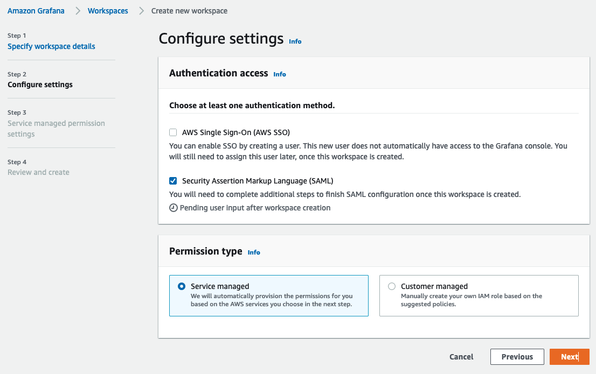
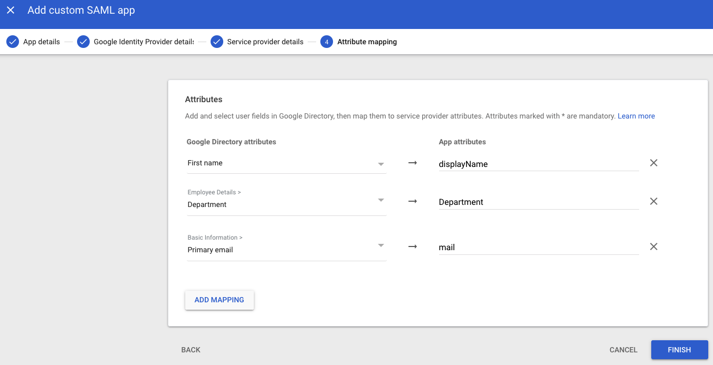
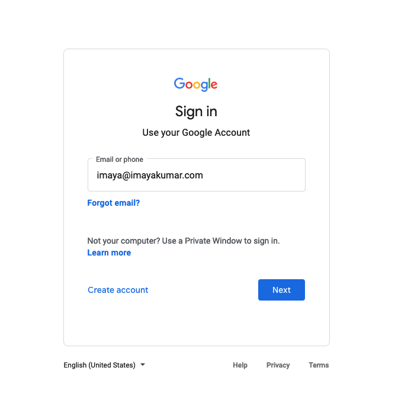
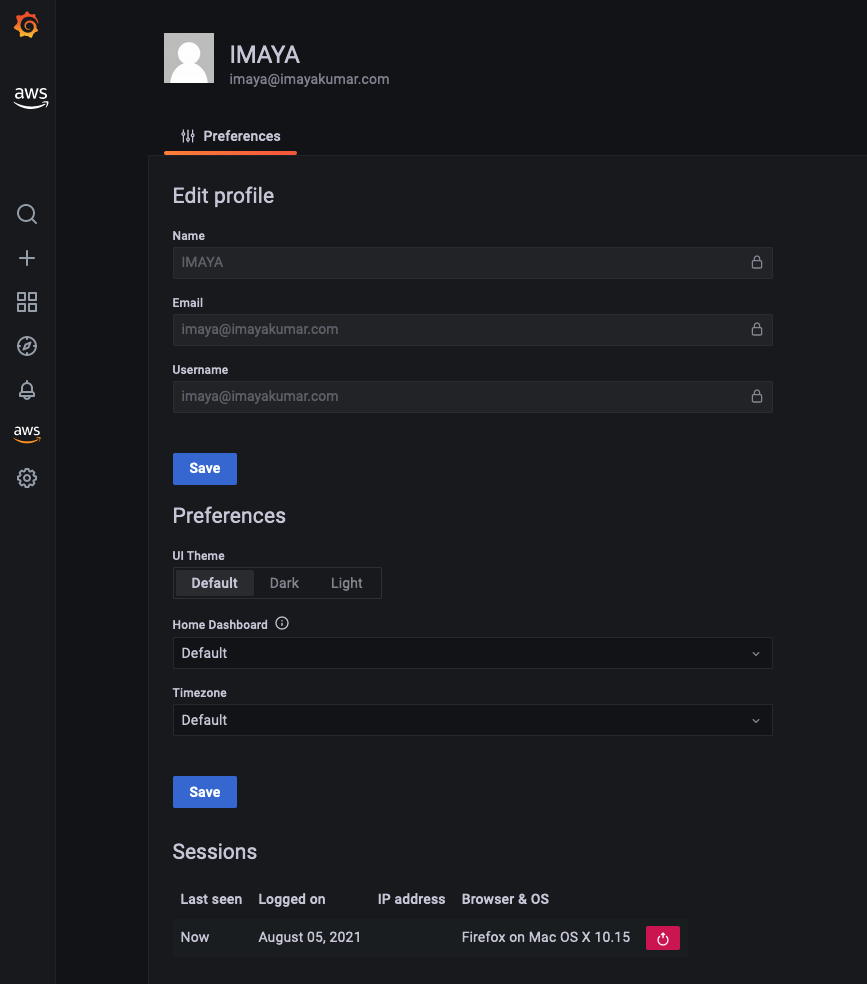

# Google Workspaces authentication

In this guide, we will walk through how you can setup Google Workspaces as an Identity provider for Amazon Managed Grafana (AMG) using SAML v2.0 protocol. In order to follow this guide you need to create a paid [Google Workspaces](https://workspace.google.com/) account in addition to having an [AMG workspace](https://docs.aws.amazon.com/grafana/latest/userguide/getting-started-with-AMG.html#AMG-getting-started-workspace) created.

### Create AMG Workspace

Login to the AMG console and click **Create workspace.** In the following screen, provide a workspace name as shown below. Click **Next**

In the **Configure settings** page, select **Security Assertion Markup Language (SAML)** option so you can configure a SAML based Identity Provider for users to login.

Select the data sources you want to choose and click **Next**

Click on **Create workspace** button in the **Review and create** screen. 

This will create a new AMG workspace as shown below.

### Configure Google Workspaces to integrate with AMG

Login to Google Workspaces with Super Admin permissions and go to **Web and mobile apps** under **Apps** section. Now click on **Add App** and select **Add custom SAML app.** Now give the app a name as shown below. Click **CONTINUE.**

On the next screen, click on **DOWNLOAD METADATA** button to download the SAML metadata file. Click **CONTINUE.**

On the next screen, you will see the ACS URL, Entity ID and Start URL fields. You can get the values for these fields from the AMG console. 

Select **EMAIL** from the drop down in the **Name ID format** field and select **Basic Information > Primary email** in the **Name ID** field.

Click **CONTINUE.**

In the **Attribute mapping** screen, make the mapping between **Google Directory attributes** and **App attributes** as shown in the screenshot below

For users logging in through Google authentication to have **Admin** privileges in **AMG,** set the **Department** field’s value as ***monitoring*.**

### Upload SAML Metadata into AMG

 Now on the AMG console, click **Upload or copy/paste** option and select **Choose file** button to upload the SAML metadata file downloaded from Google Workspaces earlier. 

In the **Assertion mapping** section, type in **Department** in the **Assertion attribute role** field and **monitoring** in the **Admin role values** field. This will allow users logging in with **Department** as **monitoring** to have **Admin** privileges in Grafana so they can perform administrator duties such as creating Dashboards, datasources and such.

Set values under **Additional settings - optional** section as shown in the screenshot below. Click on **Save SAML configuration.** 

Now AMG is setup to authenticate users using Google Workspaces. When users login, they will be redirected to the Google login page as shown below

After entering their credentials, they will be logged into Grafana as shown in the screenshot below.

